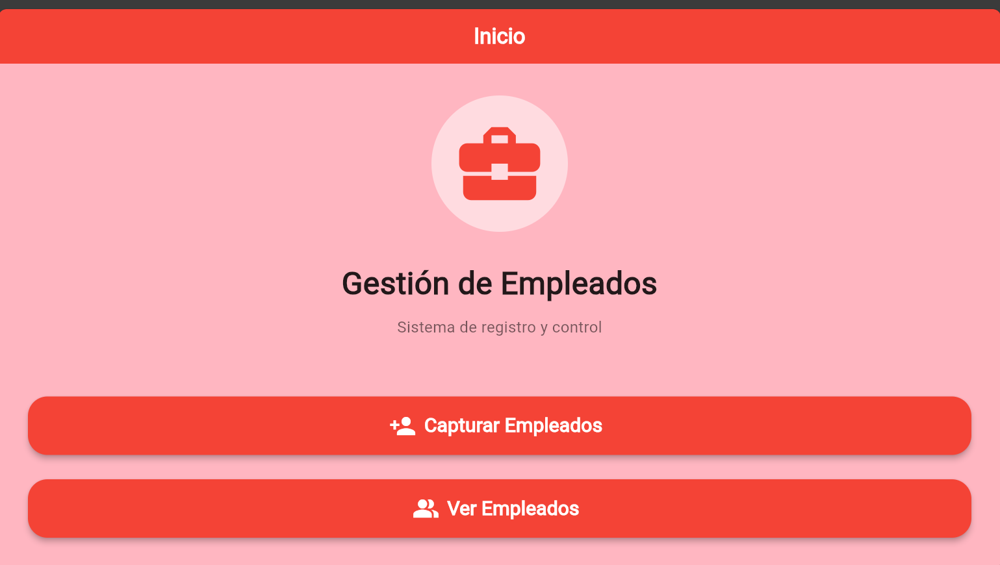
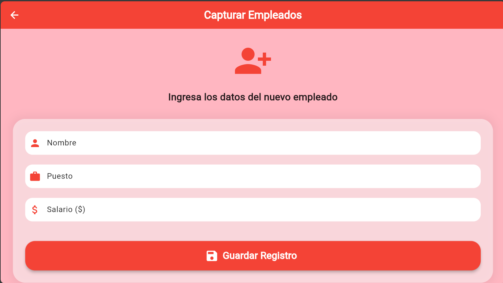
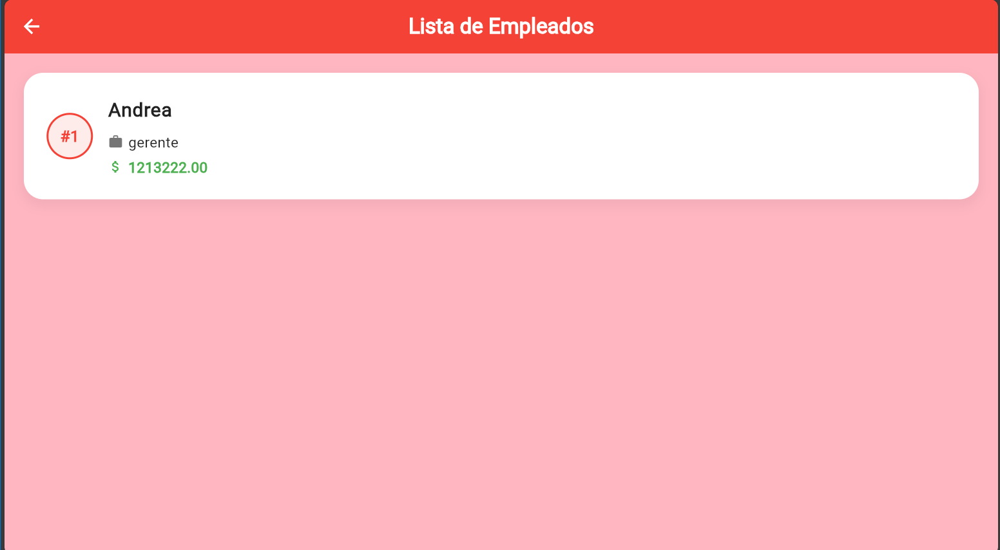

# Proyecto de Flutter: Formulario y Diccionario de Empleados

Este es un proyecto realizado en **Flutter** para la gestión básica de empleados en memoria. Demuestra el uso de un formulario de captura, el manejo de datos a través de una clase custom y su almacenamiento temporal utilizando la estructura de datos tipo diccionario (`Map`) en Dart.

### Vistas del Proyecto
A continuación, se muestran capturas de la aplicación en funcionamiento:






## Características Principales

*   **Clase Empleado:** Modela la información básica del empleado (ID autonumérico, Nombre, Puesto y Salario).
*   **Diccionario Local:** Mantiene el estado en la memoria a través de un `Map<int, Empleado>`.
*   **Agente Guardador:** Un script central encargado de recibir los datos del formulario, auto-incrementar un ID lógico, y añadir el objeto al diccionario.
*   **Interfaz Gráfica Atractiva:** Interfaz construida con Material Design, paleta de colores personalizada (rojo brillante y rosa claro) junto a *snackbars* y *cards*.
*   **Rutas Nombradas:** Para una navegación limpia entre Inicio, Formulario y Lista (`/`, `/captura`, `/ver`).
*   **Agente Git Integrado:** Cuenta con un script propio `agenterepositorio.dart` escrito en código nativo de Dart que puede interactuar para la subida automatizada y simplificada a GitHub.

## Estructura de Archivos

Dentro de la carpeta `lib/` podrás encontrar cómo está dividido el patrón de diseño utilizado:
```text
lib/
├── main.dart                      # Configuración de tema y rutas
├── inicio.dart                    # Pantalla con menú principal
├── capturaempleados.dart          # Formulario con validación
├── verempleados.dart              # Vista tipo ListView.builder
├── claseempleado.dart             # Entidad de modelo
├── diccionarioempleado.dart       # Archivo de estado en memoria pura
└── guardardatosdiccionario.dart   # Controlador/agente de almacenamiento
```

## ¿Cómo ejecutar el proyecto?

1. Clona este repositorio o asegúrate de tener Flutter instalado en tu equipo.
2. Descarga las dependencias usando la terminal:
   ```bash
   flutter pub get
   ```
3. Ejecuta el código (en simulador web, móvil o de escritorio):
   ```bash
   flutter run
   ```

---
*Desarrollado para aprendizaje nivel principiante / intermedio en Flutter.*
